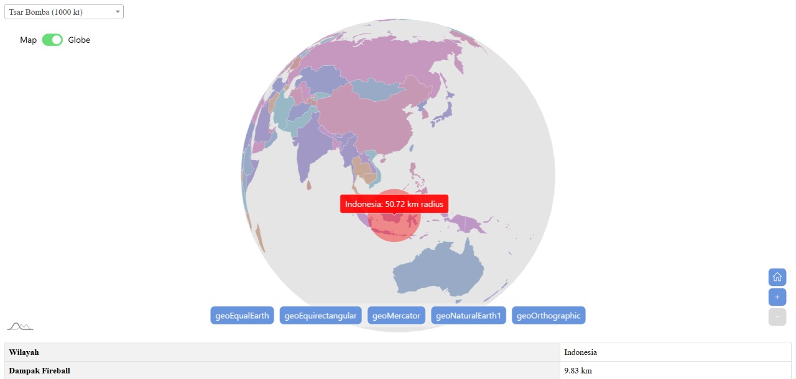

# Atomic Range Prediction

## 📌 Deskripsi
**Atomic Range Prediction** adalah sebuah aplikasi berbasis web yang memungkinkan pengguna untuk memprediksi luas sebaran bom atom pada area tertentu. Dengan menggunakan alat dari **amCharts 5**, aplikasi ini menampilkan peta interaktif dengan berbagai proyeksi geografis dan kontrol zoom yang memudahkan pengguna dalam menjelajahi peta.

## ✨ Fitur Utama
- **Peta Interaktif** dengan berbagai proyeksi:
  - 🌍 geoEqualEarth
  - 🗺️ geoEquirectangular
  - 🗾 geoMercator
  - 🌎 geoNaturalEarth1
  - 🌐 geoOrthographic
- **Kontrol Zoom** untuk navigasi yang lebih mudah
- **Prediksi Luas Sebaran** bom atom berdasarkan perhitungan ilmiah
- **Animasi Efek** saat pengguna memilih area target
- **Informasi yang Ditampilkan** dalam bentuk:
  - **Popup** interaktif
  - **Tabel data** di bawah peta

## 🎯 Cara Menggunakan
1. **Buka Aplikasi** di browser.
2. **Pilih Area** pada peta dengan klik lokasi yang diinginkan.
3. **Animasi Efek** akan dijalankan secara otomatis.
4. **Informasi Prediksi** luas sebaran akan muncul dalam popup.
5. **Lihat Detail** dalam bentuk tabel di bawah peta.

## 🛠️ Teknologi yang Digunakan
- **HTML** & **CSS** untuk tampilan antarmuka
- **amCharts 5** untuk visualisasi peta dan animasi
- **JavaScript** untuk pengolahan data dan interaksi pengguna

## 📷 Preview Gambar
Berikut ini tampilan Atomic Range Prediction menggunakan tangkapan gambar.



## 🚀 Instalasi & Menjalankan
1. Clone repositori:
   ```sh
   git clone https://github.com/username/atomic-range-prediction.git
   ```
2. Buka file `index.html` di browser.
3. Nikmati fitur prediksi dan eksplorasi peta interaktif!


---
💡 **Atomic Range Prediction - Eksplorasi dampak bom atom dengan peta interaktif dan animasi modern!**

